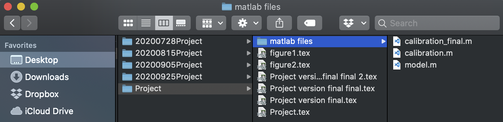
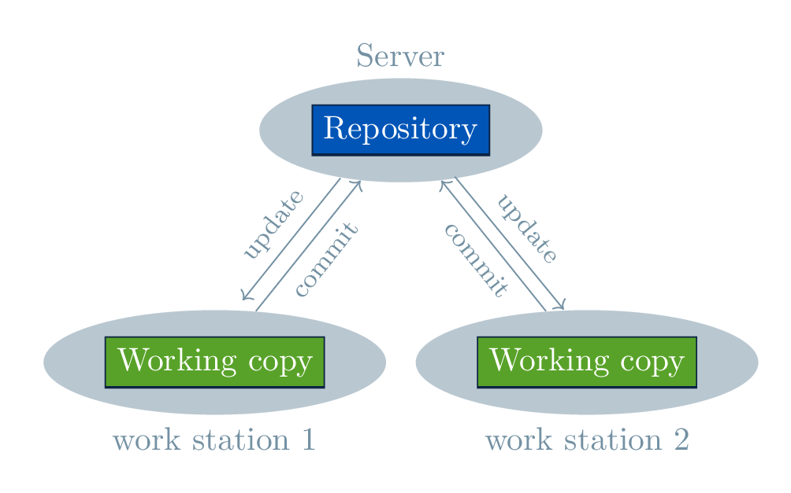
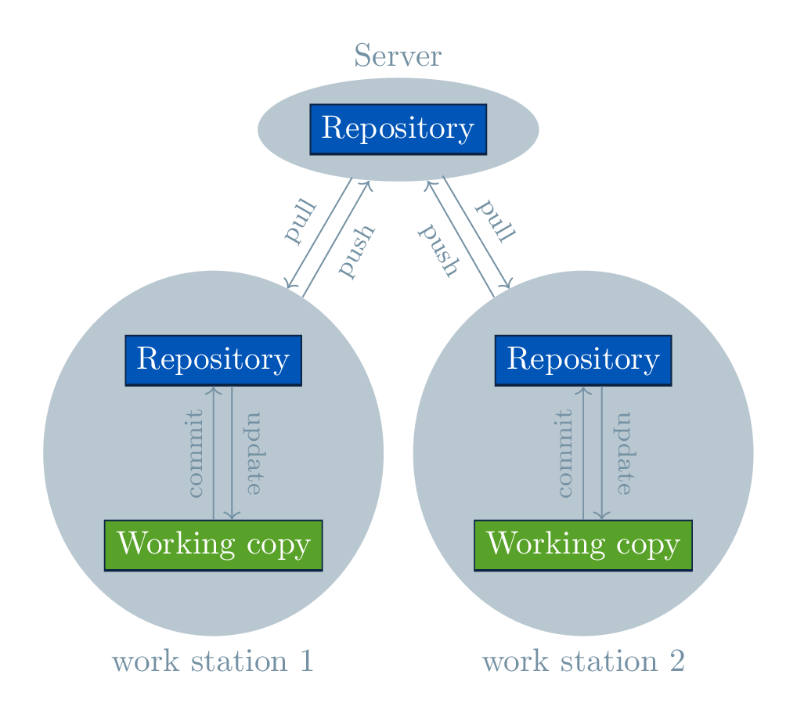

# Git  para economistas

La idea de este repositorio es documentar los beneficions del uso de *Git* en ciencias sociales y, en particular, en el campo de la Economía. La documentación estará diseñada para que personas sin experiencia previa entiendan las ventajas de este sistema de control de versión y tengan una idea de cómo incorporarlo en su estructura de trabajo. Los ejemplos se orinetarán hacia la producción de un paper académico, pero debería ser fácil para el usuario entender los alcances para el desarrollo de cualquier aplicación que utilice archivos de texto como insumo.

Disclaimer: este es un documento en desarrollo. Sientete con la confianza de colaborar: usamos Git, asi que cualquier cambio que le hagas puede ser incorporado de forma segura. Además, ninguno de los colaboradores se considera un experto en sistemas de control de versión. Somos todos usuarios, algunos con más experiencia que otros.

## Introducción

Git es us software de control de versión que se ha popularizado exponencialmente en los últimos 10 años. A pesar de su alta popularidad, mayormente entre programadores, existen muchos mitos y confusión sobre su uso y capacidades. Esto se debe principalmente a que su masificación se ha hecho mediante de interfaces de usuario (**UI**, por User Interface) que lo expanden y hacen más amigable con el usuario. Por ejemplo, hoy en día el promedio de los economistas conoce o ha escuchado el nombre de la plataforma GitHub pero no las diferencias con Git (a secas).

En esta sección sección explicamos las diferencias entre los distintos tipos de control de version, abordamos en particular el uso de Git y, finalmente, profundizamos en algunas de las interfeces de usuario mas populares.

### Control de versión

El control de versión, como su nombre lo indica, busca documentar ordenadamente los cambios que se realizan en uno o varios archivos dentro de un proyecto. Las razones del porqué esto es deseado son diversas. Una de las  más probables es que algunos cambios tienen efectos no proyectados en el resultado final y que poder analizarlos --- o deshacerlos --- ordenadamente agrega valor en la fluidez del proyecto.

Este es un problema que encontramos en la vida diaria. A modo de ejemplo, imaginemos que estamos escribiendo un paper que requiere calibrar un modelo con distintos parámetros. En un mundo en donde el modelo es una línea recta, hacer cambios y recordarlos no es tan difícil. Pero  si el modelo contiene 10 parámetros, por ejemplo, la complejidad aumenta varios ordenes de magnitud. Ahora supongamos que encontramos una representación que nos gusta, pero nos gustaría seguir explorando otras posibilidades. Lo que hará el usuario promedio es hacer una copia completa del estado actual del proyecto y guaradarla con un nombre tipo: "20200925_calibracionBuena". Pero qué pasa si además de estar cambiando la calibración estamos cambiando el algoritmo de solución, algunos detalles en el cuerpo del paper? Lo mas probable es que una vez que el proyecto avance los cambios se hacen más difíciles de trazar y, por lo tanto, son más costosos de hacer. Este problema se multiplica si se trabaja de forma colaborativa. Quién cambió qué? qué pasa si hago un cambio catastrófico y no hice un back-up?  

<center>
	<figcaption>Naive Version Control</figcaption>
	</img>
</center>

Este problema no es nuevo. A diferencia de nuestro sistema "naive" en la figura arriba, los desarrolladores de software --- que vienen pensando en este problema por décadas--- han encontrado soluciones tanto cómodas (facilidad para trazar cambios), como eficientes (rápidas y que ocupan poca memoria). Todos ellos (incluso nuestro ejemplo) se basan en el registro de fotografías tomadas en un momento determinado. 

Para entender cómo funcionan los sistemas de control de version es bueno introducir un poco de la jerga. Un **repository** (comúnmente denominados "repo") es un conjunto de archivos y su historial desde su creación, mientras que  **working copy** corresponde a una versión particular del repositorio. Las fotografías tomadas en un momento determinadas se conocen como **commits**.  Asi, los repositorios nacen cuando el usuario hace el primer commit de su proyecto. En la mayoría de los sitemas de control de version estos commits se hacen de forma manual (se privilegia el control sobre los cambios)

Con las definiciones anteriores en mano, podemos subdividir los sistemas de control de versión se diferencian por tres aspectos:

1. *Locales*: mantienen la información de todos los cambios de manera loca (i.e. en el computador del usuario). El problema de este tipo de sistemas es que no permiten la colaboración.

2. *No distribuidos*: mantienen el repositorio en un servidor y le entregan una copia de trabajo a cada usario. Para que otros usuarios vean mi avance, yo tengo que hacer un *commit* y ellos tienen que hacer un **update** de la copia de trabajo que están usando. La principal ventaja de los sistemas no distribuidos es que permiten la colaboración y que el tráfico de datos es menor. No obstante, el riesgo de perderlo todo depende de qué tan seguro sea el servidor central.
   
3. Distribuidos: le entrega el repositorio completo a cada usuario. Esto minimiza la posibilidad de una pérdida catastrófica. Además, agiliza la revision de versiones pasadas sin tener que estar conectados al servidor central. Para que mis colaboradores puedan ver los cambios que he hecho primero tengo que hacer el *commit* de los cambios y luego enviarlos al servidor --- acto conocido como **push** --- , luego ellos tienen que solicitar al servidor los cambios del repositorio  --- **pull**--- y pasar los cambios a su copia de trabajo.

<center>
	<figcaption>Non-distributed version control system </figcaption>
	</img>
	<figcaption>Distributed version control system </figcaption>
	</img>
</center>


En conclusión, un sistema de control de versión es un secretario que mantiene registros de toda la información relevante respecto de cambios hechos en un trabajo. El software elabora dichos registros cuando los usuarios están listos para "comprometer" los cambios. A pesar de que el los sitemas no distribuidos tienen menos pasos para que los cambios que hacemos puedan ser vistos por nuestros colaboradores, y que la copia de trabajo sea mas liviana en comparacion con los sitemas distribuidos, los beneficions de estos últimos --- seguridad, rapidez, comodidad--- dominan fuertemente en comparación con sus deficiencias. Esto hace que sistemas como Git y Mercurial (ambos distribuidos) sean los mas utilizados en en mundo.

### Qué es Git y cómo funciona

Como se mencionó anteriormente, Git es un sistema distribuido de control de versión. Uno de los más utilizados en el mundo. Fue creado en 2005 por [Linus Torvards](https://en.wikipedia.org/wiki/Linus_Torvalds) para el desarrollo del sistema operativo Linux. Lo que esencialmente hace, es registrar los cambios de una versión a otra y presenta al usuario la suma de todos esos cambios: algo asi como la integral de la derivada. La principal ventaja de este sistema es que esta optimizado para ser rápido y eficiente en el uso de espacio, además de disminuir la probabilidad de una perdida catastrofica.  

Git es un software que se instala en el computador de los usuarios y pude ser utilizado de forma local (i.e. no es necesario un servidor). Una vez instalado, el usuario puede acceder a las utilidades del software a través de la linea de comando (terminal). Algunos sistemas operativos  o aplicaciones (como Anaconda de Python)  instalan Git por defecto, por lo que puede que ya tengas Git en tu sistema. Para verificar esto escribe `git --version` en el terminal. Si está instalado deberías tener un mensage y no un error:

``` git
$ git --version
git version 2.24.3 (Apple Git-128)
```
Parte del set up inicial incluye el definir un nombre de usuario y correo electrónico, datos que servirán para identificar la autoría de los cambios. Podemos definir estos parámetros globalmente (para el usuario de la sesión) escribiendo

``` git
$ git config --global user.email "tu_email@ejemplo.com"
$ git config --global user.name "Tu Nombre o NickName"
```

Es [este link](https://www.atlassian.com/git/tutorials/setting-up-a-repository/git-config) se pueden encontrar mas opciones para configurar Git.

Para explicar como incluir Git en el dia a dia proponemos un ejemplo. Supongamos que tenemos una carpeta en el escritorio llamada "project" y que dentro de ella se encuentran (o encontraran) todos los archivos relevantes para nuestro proyecto. Para inicializar Git en esta carpeta,  solo debemos abrirla en el terminal (o navegar hasta ella) y escribir `git init`. Este comando crea una carpeta oculta dentro de `project` llamada `.git`,  en donde se guaradará toda la información concerniente al control de versión. Hay otros archivos que nos pueden ayudar a modificar el comportamiento del programa, como por ejemplo`.gitignore`, en donde literalmente escribimos que tipo de archivos queremos que Git ignore (por ejemplo archivos auxiliares de la compilación de latex, bases de datos, archivos binarios, etc). 

<p>
<details> <summary>Ejemplo </summary>
  Un ejemplo concreto de qué podemos incluir en un archivo `.gitignore` es el siguiente (el simbolo `##` implica comentario):

  ``` git
  ## Folders
  ignoreThisFolder/

  ## Ignore the files with the following extensions:
  *.aux
  *.lof
  *.log
  *.lot
  *.fls
  *.out
  *.toc
  *.dvi
  *.ps
  *.pdf
  ```
En este ejemplo todo el contenido del directorio relativo  `ignoreThisFolder` será ignorado por Git, al igual que todos los archivos con las extensiones `aux`, `lof`, etc. 
</details>
</p>

Una vez que se tienen cambios que se quieren registrar, lo primero que se tiene que hacer es pasar estos archivos al *staging area*, una especie de escenario en donde se presentan los cambios que queremos registrar en un *commit* en particular (notese que es probable que no todos los cambios se quieran registrar al mismo tiempo). Para efectos del ejemplo, supongamos que tenemos nuestro archivo `.gitignore` y el archivo de texto `readme.md` listos, pero que sólo queremos incorporar en el *commit* inicial al primero. Para ello escribimos en el terminal `git add .gitignore` (en caso de que se quieran incluir todos los archivos se puede tipear `git add -A`). Para revisar el estado del repositorio se escribe `git status`. En nuestro ejemplo, el status después de haber incorporado a `.gitignore` en el escenario es el sigente

```git
$ git status        
On branch master

No commits yet

Changes to be committed:
  (use "git rm --cached <file>..." to unstage)
        new file:   .gitignore

Untracked files:
  (use "git add <file>..." to include in what will be committed)
        Readme.md
```

Cada *commit* tiene su identificación única (40 dígitos alpha-numéricos), pero Git nos permite agregarle un mensaje para poder identificarlo con mayor facilidad, en nuestro caso lo llamaremos "Primer Commit"

``` git
 $git commit -m "Primer Commit"
[master (root-commit) e0566e0] Primer Commit
 1 file changed, 245 insertions(+)
 create mode 100755 .gitignore
```
El resultado de escribir `git commit -m "Primer Commit"` es un registro llamado (sus primeros 7 dígitos) `e0566e0` en donde cambiamos (agregamos) 1 archivo con 245 líneas. Este mensage, en general,  nos entrega un resumen de los cambios realizados en comparacion con el *commit* anterior. Por ejemplo, una vez que agregamos 

```git
 $git commit -m "Readme added"
[master 38b5541] Readme added
 1 file changed, 150 insertions(+)
 create mode 100644 Readme.md
 ```

- [ ]  Qué pasa con los archivos binarios? 

### Trabajando colaborativamente con el "yo" del futuro y pasado

- [ ]  Mencionar que es el branching y trabajo no lineal
- [ ]  Mencionar qhe Git no es mágico!! Igualmente requiere un orden y manejo de conflictos 
- [ ]  Introducción a los árboles Git
- [ ]  Ejemplo concreto: como el orden de Git permite hacer cambios con mayor confianza.

### Trabajando colaborativamente con un equipo de personas

- [ ]  La idea principal aquí es explicar como compartir los repositorios de forma segura y de cómo Git ayuda a hacerlo de forma ordenada.
- [ ]  En esta sección se introducen los UI de GitHub o GitLab

#### Protocolos de comunicación de Git

1. Local. El ejemplo más prehistórico: usar un pendrive!! 
2. HTTP y HTTPS
3. SSH
4. GIT 

###  Interfaces de Usuario: the ugly truth of Git

- [ ]  como se pudo ver en secciones anteriores, Git en el "command Line" es poco amigable (en un principio).
  - [ ]  Ejemplo de git init, stage and commit 
  - [ ]  Ejemplo de diff en el command line
  - [ ]  Ejemplo de árbol en el command line
  
- [ ]  Los mismos ejemplos usando VSCode y extensiones
- [ ]  La gracia de GitHub, GitLab y BitBucket: Las redes sociales del Git
  - [ ]  Pull requests
  - [ ]  Issues
  
